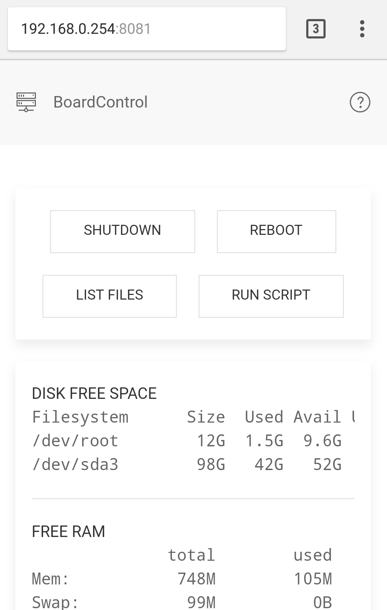

# Board Control

## Overview

Control and monitor any GNU/Linux or MacOs system from a Web UI using customizable bash commands to do action or display information. This allow to have a quick look on what is going on the system and perform any action on it without having to start a ssh session (Headless board) or interrupt your favorite movie playing (HTPC).

Mostly suited to work over local network on development board (Raspberry Pi / Orange Pi / BeagleBone..) or Linux based HTPC. The webUI can be used from a desktop or a phone.  

Mobile (command result cleared) |  Desktop (command result display)
:-------------------------:|:-------------------------:
  |    

## Requirements

BoardControl uses Node.js with a few modules. This allow to run it within minutes on any system without having to install and configure a classic web server.

## Install Node.js

> Please refer to the latest installation guide on Node.js website:  
> https://nodejs.org/en/download/package-manager/  
> or check below for Debian and Ubuntu based Linux distributions

Install Node.js 8 (LTS) on Debian and Ubuntu based Linux distributions

```bash
curl -sL https://deb.nodesource.com/setup_8.x | sudo -E bash -
sudo apt-get install -y nodejs
```

Alternatively, for Node.js 9 (Current version):

```bash
curl -sL https://deb.nodesource.com/setup_9.x | sudo -E bash -
sudo apt-get install -y nodejs
```

## Get BoardControl

```bash
git clone https://github.com/lexb2/BoardControl.git
```

## Use BoardControl

#### Start one time as user

```bash
node BoardControl/app.js
```

The following message should be displayed:

> "BoardControl started and listening on port 8081"

At this point BoardControl runs with your user rights, it means the commands that required root access won't work.

#### Automatically run at startup as root

Install Forever globally to allow the program to run continuously.
https://www.npmjs.com/package/forever

```bash
sudo npm install forever -g
```

The commands below copy BoardControl in /opt.  
All modification of the configuration should be done here.  
You can choose another location but if you do so, don't forget to update the `APP` value in `/etc/init.d/boardcontrol` to indicate the right path.

```bash
sudo cp -R BoardControl/ /opt
sudo cp /opt/BoardControl/boardcontrol /etc/init.d/boardcontrol
sudo chmod +x /etc/init.d/boardcontrol
sudo update-rc.d boardcontrol defaults
sudo service boardcontrol start
```

#### Access BoardControl

Simply browse:  
http://localhost:8081  
if you installed it locally,
or   
http://ipAdressOfTheMachine:8081


#### Configure BoardControl

BoardControl is customisable using the file `default.json`
located in `BoardControl/config/`.


> Some characters need to be escaped for JSON:  
> " (Double quote) is replaced with \"  
> \ (Backslash) is replaced with \\  
> See https://realguess.net/2016/07/29/escaping-in-json-with-backslash/

`commands` define the actions that can be done using the UI button.

Field | Description
--- | --- 
label | button label display on the website
nickname | internal code of the commands, must be unique, without space or special character
exec | the bash command to execute, result will be shown on website

`informations` define the information that are always display at the bottom of the webpage.

Field | Description
--- | --- 
label | header label
exec | the bash command to execute, result will be shown on website

```json
{
    "config": {
        "listeningPort": 8081,
        "pageTitle": "Board control",
        "commands": [
            {
                "label": "Run my command",
                "nickname": "mycommand",
                "exec": "time"
            },
            {
                "label": "Run my awesome script",
                "nickname": "myscript",
                "exec": "/path/to/my/./script.sh"
            }
        ],
        "informations": [
            {
                "label": "Some information 1",
                "exec": "free -h"
            },
            {
                "label": "Some information 2",
                "exec": "ls /"
            }
        ]
    }
}
```

#### Config example

```json
{
    "config": {
        "listeningPort": 8081,
        "pageTitle": "Board control",
        "commands": [
            {
                "label": "Mount",
                "nickname": "mont",
                "exec": "mount -a"
            },
            {
                "label": "Unmout",
                "nickname": "umount",
                "exec": "umount /media/*"
            },
            {
                "label": "Shutdown",
                "nickname": "shutdown",
                "exec": "poweroff"
            },
            {
                "label": "Reboot",
                "nickname": "reboot",
                "exec": "reboot"
            },
            {
                "label": "Run my awesome script",
                "nickname": "myscript",
                "exec": "/path/to/my/./script.sh"
            }
        ],
        "informations": [
            {
                "label": "Public IP address",
                "exec": "curl -s http://checkip.dyndns.org/ | sed 's/[a-zA-Z<>/ :]//g'"
            },
            {
                "label": "Local IP address",
                "exec": "ifconfig | grep -E \"([0-9]{1,3}\\.){3}[0-9]{1,3}\" | grep -v 127.0.0.1 | awk '{ print $2 }' | cut -f2 -d: | head -n1"
            },
            {
                "label": "Top cpu process",
                "exec": "ps -eo pid,comm,%cpu,%mem --sort=-%cpu | head -n 5"
            },
            {
                "label": "Free ram",
                "exec": "free -h"
            },
            {
                "label": "Uptime",
                "exec": "uptime"
            },
            {
                "label": "Disk free space",
                "exec": "df -h | head -n2 "
            }
        ]
    }
}
```

## Disclaimer
This software comes with no warranty, it doesn't feature any authentification system and run as root as per installation guide below. Please use only on a trusted local network and do not expose this server to the internet, else anyone could take control your machine (hopefully only with the commands you defined).

## Uninstall

sudo update-rc.d boardcontrol remove  
sudo rm /etc/init.d/boardcontrol

And simply delete BoardControl folder (in /opt as per installation guide)